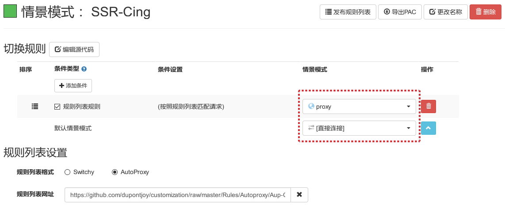

#### 设置备份

扩展: https://addons.mozilla.org/zh-CN/firefox/addon/switchyomega/

#### 多情景模式设置

##### 1. 主情景模式: auto switch

匹配第一个订阅规则时走Proxy, 否则走SSR-Cing

##### 2. 副情景模式: SSR-Cing

不匹配第一个订阅规则时:

- 匹配第二个订阅规则时走Proxy, 否则直连

#### 多情景模式流程

